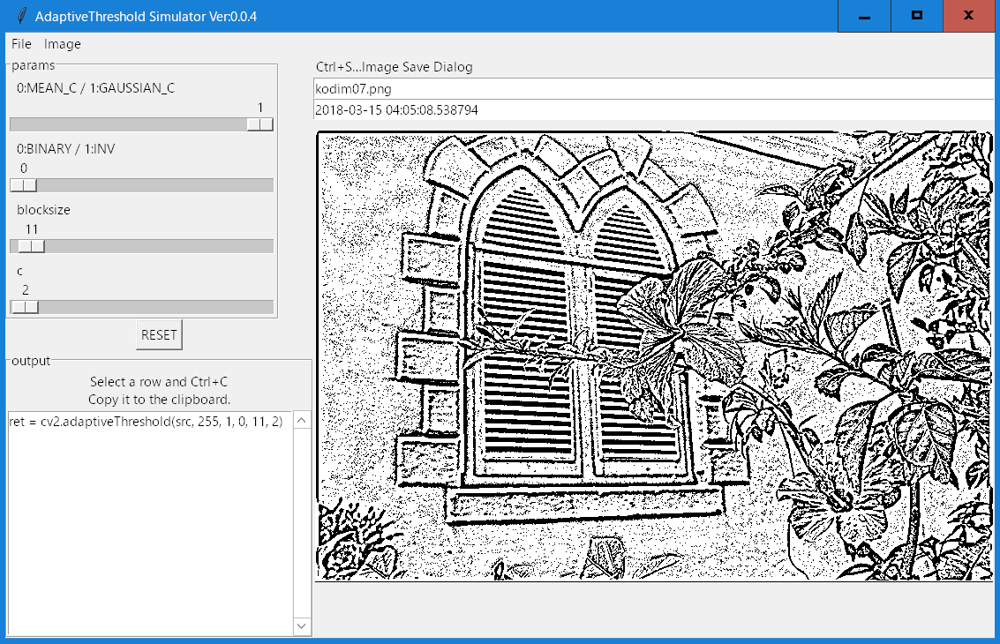

## Introduction

Adaptive Threshold Simulator

Python cv2.adaptiveThreshold function parameter Simulator.

GUI widget: tkinter

## Install
1. [download a ZIP](https://github.com/umyuu/AdaptiveThresholdSimulator/archive/master.zip) file.
2. Install dependencies.
 [requirements install.](requirements.txt)
 
## Dependencies
- python 3.5+
- opencv3
- Numpy

## Using

```
python adaptivethreshold.py images\kodim07.png
```

## Source code License
[MIT License](LICENSE)
